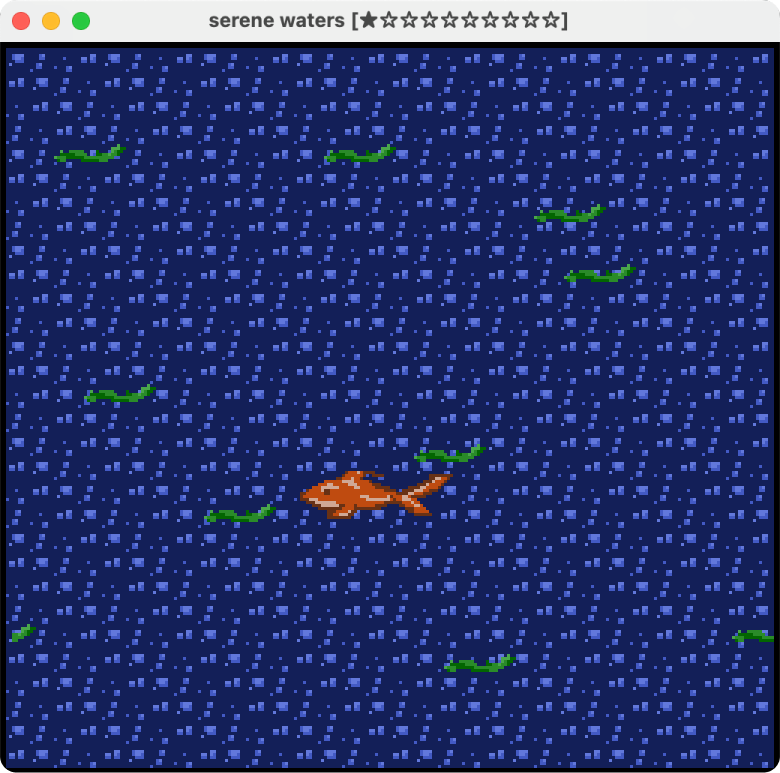

# Serene Waters

Author: Fara Yan (fayan)

Design: Serene Waters is an underwater game where you guide Flair, a hungry goldfish, through the ocean. The game uses an asset pipeline to handle the palette data, tile information, and rendering sprites larger than 8×8 pixels under PPU64 constraints.

### How the Asset Pipeline works:

Our asset pipeline follows these steps:
1. I used GIMP to design the game assets and exported them as a png file: [goldfish.png](./goldfish.png). This includes the bubble tiles, and goldfish and seaweed sprites.
2. I added a build step to `Maekfile.js` that can be run with `./dist/assets`. This runs the main function in [load_assets.cpp](./load_assets.cpp), which parses `goldfish.png` into 8x8 tiles and uses `load_chunk` to store a table of palettes, tiles, and sprites into `game.sprites`. This will create three palettes (for bubbles, goldfish, and tiles), and also calculate offsets for sprite tiles.
3. During runtime, we read our processed assets via `Sprites::load` in [Sprites.cpp](./Sprites.cpp) on `game.sprites`. This reads our packed data using `read_chunk`, initializes the goldfish and seaweed game sprites, and loads in our tile and palette table to use during runtime.

### How To Play:

Flair the goldfish is hungry! Luckily, the waters are abundant with floating seaweed. Your mission is to eat all 10 pieces of seaweed that are drifting through the waters.

Controls: Use the left/right/up/down arrows to move flair.

This game was built with [NEST](NEST.md).

